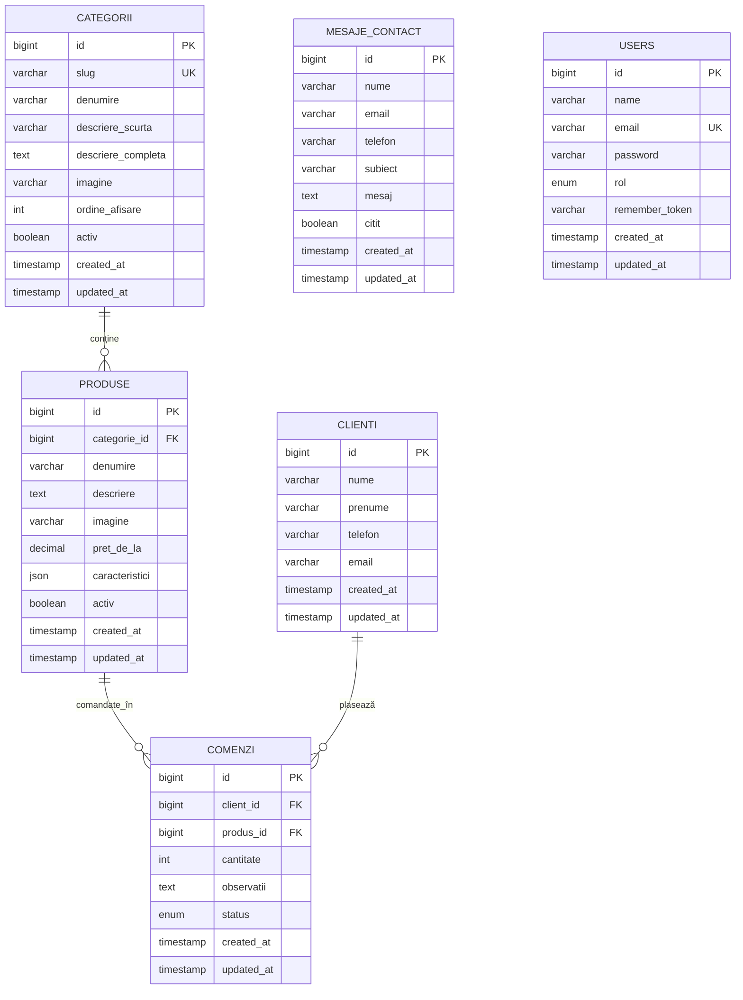

# 08. Arhitectura bazei de date (AS9)

## 8.1. Considerații generale

Pentru proiectul FotoMoments am proiectat o **bază de date relațională normalizată** (formă normală 3 — 3NF) folosind **MySQL 8** (sau MariaDB 10, din XAMPP). Schema include 7 tabele principale care acoperă atât catalogul de produse afișat public, cât și structurile necesare unei viitoare extinderi (clienți, comenzi, panou administrativ).

**În Laravel, schema NU este creată prin SQL brut, ci prin migrate-uri** (clase PHP în `database/migrations/`). Aceasta permite ca orice coleg sau profesor care primește proiectul să rec re-creeze structura completă cu o singură comandă: `php artisan migrate --seed`.

## 8.2. Diagrama ER (entitate-relație)

```
┌─────────────────────────┐         ┌─────────────────────────┐
│      categorii          │         │        produse          │
│─────────────────────────│   1:N   │─────────────────────────│
│ id              PK      │◄────────│ id              PK      │
│ slug            UQ      │         │ categorie_id    FK ─────┤
│ denumire                │         │ denumire                │
│ descriere_scurta        │         │ descriere               │
│ descriere_completa      │         │ imagine                 │
│ imagine                 │         │ pret_de_la              │
│ ordine_afisare          │         │ caracteristici  (JSON)  │
│ activ                   │         │ activ                   │
│ created_at, updated_at  │         │ created_at, updated_at  │
└─────────────────────────┘         └─────────────────────────┘
                                              ▲
                                              │ 1:N
                                              │
┌─────────────────────────┐         ┌─────────────────────────┐
│        clienti          │         │        comenzi          │
│─────────────────────────│   1:N   │─────────────────────────│
│ id              PK      │◄────────│ id              PK      │
│ nume                    │         │ client_id       FK      │
│ prenume                 │         │ produs_id       FK ─────┘
│ telefon                 │         │ cantitate               │
│ email                   │         │ observatii              │
│ created_at, updated_at  │         │ status   ENUM           │
└─────────────────────────┘         │ created_at, updated_at  │
                                    └─────────────────────────┘

┌─────────────────────────┐         ┌─────────────────────────┐
│    mesaje_contact       │         │         users           │
│─────────────────────────│         │─────────────────────────│
│ id              PK      │         │ id              PK      │
│ nume                    │         │ name                    │
│ email                   │         │ email                   │
│ telefon (nullable)      │         │ password                │
│ subiect                 │         │ rol     ENUM            │
│ mesaj                   │         │ remember_token          │
│ citit (bool)            │         │ created_at, updated_at  │
│ created_at, updated_at  │         └─────────────────────────┘
└─────────────────────────┘
```

### Versiune Mermaid (alternativă)



## 8.3. Descrierea fiecărui tabel

### 8.3.1. `categorii`

Stochează cele 8 categorii principale de produse afișate pe site.

| Coloană | Tip | Constrângeri | Descriere |
|---|---|---|---|
| `id` | BIGINT UNSIGNED | PRIMARY KEY, AUTO_INCREMENT | Identificator unic |
| `slug` | VARCHAR(100) | UNIQUE, NOT NULL | Identificator URL (ex: `cani`, `tricouri-maiouri`) |
| `denumire` | VARCHAR(150) | NOT NULL | Denumire afișată |
| `descriere_scurta` | VARCHAR(300) | NULL | Propoziție evocativă (pentru carduri) |
| `descriere_completa` | TEXT | NULL | Descriere extinsă (pentru pagina detaliu) |
| `imagine` | VARCHAR(255) | NULL | Calea către imagine (`img/placeholders/cat-cani.svg`) |
| `ordine_afisare` | INT | NOT NULL, DEFAULT 0 | Pentru sortare în meniu și grilă |
| `activ` | BOOLEAN | NOT NULL, DEFAULT TRUE | Permite ascunderea fără ștergere |
| `created_at` | TIMESTAMP | NULL | Automat de Laravel |
| `updated_at` | TIMESTAMP | NULL | Automat de Laravel |

**Indexuri:**
- PRIMARY KEY pe `id`;
- UNIQUE INDEX pe `slug` (folosit la căutare în URL).

### 8.3.2. `produse`

Stochează produsele specifice fiecărei categorii (6 per categorie, total 48).

| Coloană | Tip | Constrângeri | Descriere |
|---|---|---|---|
| `id` | BIGINT UNSIGNED | PRIMARY KEY, AUTO_INCREMENT | Identificator unic |
| `categorie_id` | BIGINT UNSIGNED | FOREIGN KEY → categorii(id), ON DELETE CASCADE | Categoria din care face parte |
| `denumire` | VARCHAR(200) | NOT NULL | Numele produsului |
| `descriere` | TEXT | NULL | Detalii produs (2–4 propoziții) |
| `imagine` | VARCHAR(255) | NULL | Calea către imagine |
| `pret_de_la` | DECIMAL(8,2) | NULL | Preț de pornire în MDL |
| `caracteristici` | JSON | NULL | Detalii tehnice flexibile (ex: `{"material":"ceramică","dimensiune":"330ml"}`) |
| `activ` | BOOLEAN | NOT NULL, DEFAULT TRUE | Permite ascunderea |
| `created_at` | TIMESTAMP | NULL | Automat |
| `updated_at` | TIMESTAMP | NULL | Automat |

**Indexuri:**
- PRIMARY KEY pe `id`;
- INDEX pe `categorie_id` (pentru filtrare rapidă);
- Constrângere FK cu CASCADE: dacă se șterge o categorie, se șterg și produsele ei.

### 8.3.3. `clienti`

Stochează datele clienților care plasează comenzi (folosit pentru viitorul flux de e-commerce).

| Coloană | Tip | Constrângeri | Descriere |
|---|---|---|---|
| `id` | BIGINT UNSIGNED | PRIMARY KEY, AUTO_INCREMENT | Identificator unic |
| `nume` | VARCHAR(100) | NOT NULL | Numele de familie |
| `prenume` | VARCHAR(100) | NOT NULL | Prenumele |
| `telefon` | VARCHAR(30) | NOT NULL | Telefon de contact |
| `email` | VARCHAR(150) | NOT NULL | Email |
| `created_at`, `updated_at` | TIMESTAMP | NULL | Automat |

**Notă:** în această etapă (săptămânile 1–2) tabela este creată dar **rămâne goală** — va fi populată când vom adăuga formularul de comandă.

### 8.3.4. `comenzi`

Stochează comenzile plasate de clienți (folosit pentru viitorul flux de e-commerce).

| Coloană | Tip | Constrângeri | Descriere |
|---|---|---|---|
| `id` | BIGINT UNSIGNED | PRIMARY KEY, AUTO_INCREMENT | Identificator unic |
| `client_id` | BIGINT UNSIGNED | FOREIGN KEY → clienti(id) | Clientul care a comandat |
| `produs_id` | BIGINT UNSIGNED | FOREIGN KEY → produse(id) | Produsul comandat |
| `cantitate` | INT | NOT NULL, DEFAULT 1 | Câte bucăți |
| `observatii` | TEXT | NULL | Note libere (text personalizat, instrucțiuni speciale) |
| `status` | ENUM | NOT NULL, DEFAULT 'noua' | Valori: `noua`, `in_procesare`, `finalizata`, `anulata` |
| `created_at`, `updated_at` | TIMESTAMP | NULL | Automat |

**Notă:** și această tabelă rămâne goală în etapa curentă.

### 8.3.5. `mesaje_contact`

Stochează mesajele primite prin formularul de contact de pe `/contacte`.

| Coloană | Tip | Constrângeri | Descriere |
|---|---|---|---|
| `id` | BIGINT UNSIGNED | PRIMARY KEY, AUTO_INCREMENT | Identificator unic |
| `nume` | VARCHAR(150) | NOT NULL | Numele expeditorului |
| `email` | VARCHAR(150) | NOT NULL | Email-ul expeditorului |
| `telefon` | VARCHAR(30) | NULL | Telefon (opțional) |
| `subiect` | VARCHAR(200) | NOT NULL | Subiectul mesajului (ales din dropdown) |
| `mesaj` | TEXT | NOT NULL | Conținutul mesajului |
| `citit` | BOOLEAN | NOT NULL, DEFAULT FALSE | Flag pentru viitorul panou admin |
| `created_at`, `updated_at` | TIMESTAMP | NULL | Automat |

**Notă:** această tabelă este **activă** în etapa curentă — formularul de contact salvează aici.

### 8.3.6. `users` (tabela default Laravel + coloană custom `rol`)

Folosită în viitor pentru autentificarea administratorilor.

| Coloană | Tip | Constrângeri | Descriere |
|---|---|---|---|
| `id` | BIGINT UNSIGNED | PRIMARY KEY, AUTO_INCREMENT | Identificator unic |
| `name` | VARCHAR(255) | NOT NULL | Numele utilizatorului |
| `email` | VARCHAR(255) | UNIQUE, NOT NULL | Email login |
| `email_verified_at` | TIMESTAMP | NULL | Pentru verificare email |
| `password` | VARCHAR(255) | NOT NULL | Hash bcrypt |
| `remember_token` | VARCHAR(100) | NULL | Pentru funcția „remember me" |
| `rol` | ENUM | NOT NULL, DEFAULT 'editor' | Valori: `admin`, `editor` |
| `created_at`, `updated_at` | TIMESTAMP | NULL | Automat |

**Notă:** tabela este creată default de Laravel; doar coloana `rol` este adăugată printr-o migrate suplimentară.

### 8.3.7. Alte tabele Laravel default

Laravel creează automat și următoarele tabele utilitare (neacționate de noi, dar prezente):

- `cache` și `cache_locks` — pentru cache aplicație;
- `jobs`, `job_batches`, `failed_jobs` — pentru cozile de execuție asincronă;
- `sessions` — pentru sesiunile de browser;
- `password_reset_tokens` — pentru recuperarea parolei.

## 8.4. Relațiile dintre tabele

| Relație | Tip | Descriere |
|---|---|---|
| `categorii` → `produse` | **1:N** | O categorie are mai multe produse; un produs aparține unei singure categorii |
| `clienti` → `comenzi` | **1:N** | Un client poate plasa mai multe comenzi; o comandă aparține unui singur client |
| `produse` → `comenzi` | **1:N** | Un produs poate apărea în mai multe comenzi; o comandă conține un produs (în această schemă simplificată) |

**Notă pentru o etapă viitoare:** dacă va fi nevoie să o comandă conțină mai multe produse, se va introduce o tabelă pivot `comenzi_produse` (relație N:M între `comenzi` și `produse` cu coloane suplimentare: `cantitate`, `pret_unitar_la_comanda`).

## 8.5. Reprezentarea în Eloquent (relații în modele)

```php
// Categorie.php
public function produse()
{
    return $this->hasMany(Produs::class, 'categorie_id');
}

// Produs.php
public function categorie()
{
    return $this->belongsTo(Categorie::class, 'categorie_id');
}

public function comenzi()
{
    return $this->hasMany(Comanda::class, 'produs_id');
}

// Client.php (în viitor)
public function comenzi()
{
    return $this->hasMany(Comanda::class, 'client_id');
}

// Comanda.php (în viitor)
public function client()
{
    return $this->belongsTo(Client::class);
}
public function produs()
{
    return $this->belongsTo(Produs::class);
}
```

## 8.6. Migrate-uri (modul de creare a schemei)

Schema este definită în **6 migrate-uri** specifice proiectului (peste migrate-urile default ale Laravel):

1. `XXXX_create_categorii_table.php`
2. `XXXX_create_produse_table.php`
3. `XXXX_create_clienti_table.php`
4. `XXXX_create_comenzi_table.php`
5. `XXXX_create_mesaje_contact_table.php`
6. `XXXX_add_rol_to_users_table.php`

**Comandă de execuție:**

```bash
php artisan migrate
```

Pentru resetare completă + re-populare:

```bash
php artisan migrate:fresh --seed
```

## 8.7. Seedere (popularea datelor de test)

Datele inițiale sunt inserate prin **clase Seeder** (în `database/seeders/`):

1. `CategoriiSeeder.php` — inserează cele 8 categorii;
2. `ProduseSeeder.php` — inserează cele 48 de produse (6 per categorie);
3. `DatabaseSeeder.php` — coordonatorul care apelează cele de mai sus în ordine.

**Comandă de execuție:**

```bash
php artisan db:seed
```

După rulare, baza de date conține:
- 8 rânduri în `categorii`;
- 48 rânduri în `produse`;
- 0 rânduri în `clienti`, `comenzi`, `mesaje_contact`, `users`.

## 8.8. Avantajele acestei arhitecturi

1. **Normalizare 3NF:** fără redundanțe, integritate referențială asigurată prin foreign keys;
2. **Scalabilă:** se pot adăuga ulterior tabele pentru categorii imbricate, etichete, recenzii, fără rescrierea celor existente;
3. **Securitate:** Eloquent ORM protejează automat împotriva SQL injection prin parametrizare;
4. **Portabilitate:** prin folosirea Laravel Schema Builder, schema poate fi migrată ușor de la MySQL la PostgreSQL sau SQLite, dacă va fi nevoie;
5. **Reproductibilitate:** orice coleg / profesor / coleg de echipă obține exact aceeași schemă printr-o singură comandă;
6. **Auditabilitate:** câmpurile `created_at` și `updated_at` permit urmărirea în timp a modificărilor.
